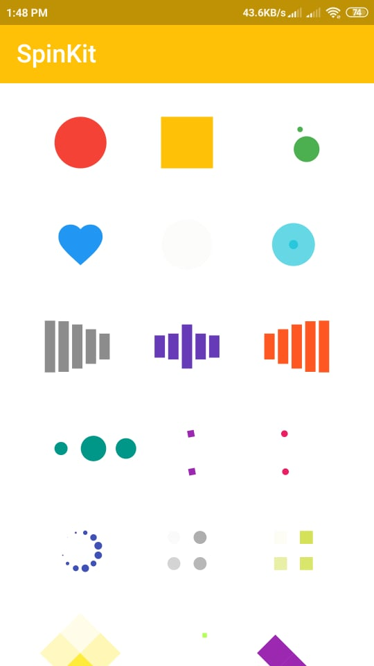
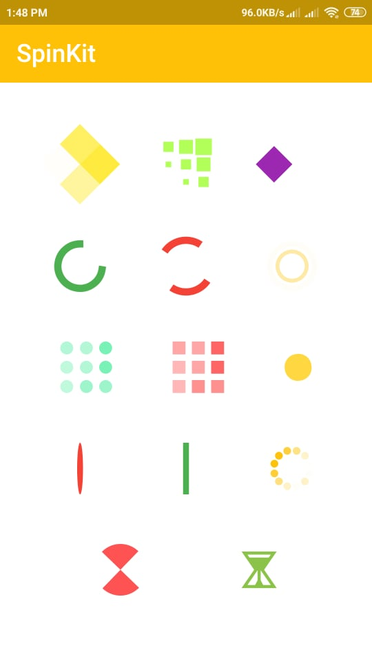

# Spinkit

This project is for learning how to use spinkit in Flutter App.

### Installing

```dart
dependencies:
  flutter_spinkit: "^4.1.2"
```

### Import

```dart
import 'package:flutter_spinkit/flutter_spinkit.dart';
```

### How To Use

```dart
const spinkit = SpinKitRotatingCircle(
  color: Colors.white,
  size: 50.0,
);
```

```dart
final spinkit = SpinKitFadingCircle(
  itemBuilder: (BuildContext context, int index) {
    return DecoratedBox(
      decoration: BoxDecoration(
        color: index.isEven ? Colors.red : Colors.green,
      ),
    );
  },
);
```

```dart
final spinkit = SpinKitSquareCircle(
  color: Colors.white,
  size: 50.0,
  controller: AnimationController(vsync: this, duration: const Duration(milliseconds: 1200)),
);
```

## Screenshots
 &nbsp;&nbsp;&nbsp;&nbsp;&nbsp;&nbsp;&nbsp;&nbsp;&nbsp;&nbsp; 
